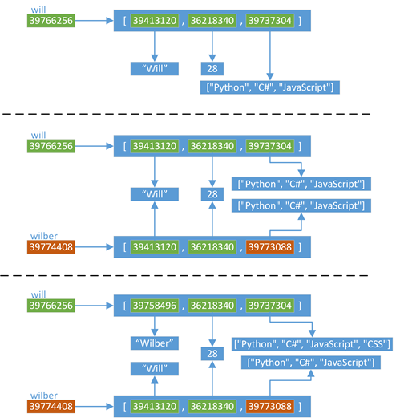

# 知识点

* [返回上层目录](../python.md)
* [序列](#序列)
* [yield](#yield)
* [赋值、浅拷贝、深拷贝的区别](#赋值、浅拷贝、深拷贝的区别)


# 序列

序列sequence是python中最基本的数据结构，本文先对序列做一个简单的概括，之后简单讲解下所有序列都能通用的操作方法。

**1序列概念**
列表和元组这两种数据类型是最常被用到的序列，python内建序列有六种，除了刚刚有说过的两种类型之外，还有字符串、Unicode字符串、buffer对像和最后一种xrange对像，这几种都是不常使用的。

**2序列通用操作方法**
所有序列类型有一些可以通用的方法，比如：索引、分片、乘、加，检查成员资格。当然还有一些很实用的内建函数，像是计算序列长度，找出序列中的最大或最小无素等。下来就来一一的介绍下序列的基本操作方法吧。

**2.1什么是索引**：序列中的每一个元素都有自己的位置编号，可以通过偏移量索引来读取数据。最开始的第一个元素，索引为0，第二个元素，索引为1，以此类推；也可以从最后一个元素开始计数，最后一个元素的索引是-1，倒数第二个元素的索引就是-2，以此类推。

**2.2序列相加**：相同数据类型序列之间可以相加，不同数据类型序列不能相加。

列表类型序列相加

```python
print([1,2]+[3,4])
#[1, 2, 3, 4]

list1 = list([1,2])
list2 = list([3,4])
list3 = list1 + list2
print(list3)
#[1, 2, 3, 4]
```

字符串类型序列相加

```python
print('hello'+'.python')
#hello.python
```

元组类型序列相加

```python
print((1,2,3)+(4,5,6))
#(1, 2, 3, 4, 5, 6)

a = (1,2,3)
b = (4,5,6)
c = a + b
print(c)
#(1, 2, 3, 4, 5, 6)
```

**2.3序列乘法**：把原序列乘X次，并生成一个新的序列

```python
list1 = list([1,2])
list1_3 = list1 * 3
print(list1_3)
# [1, 2, 1, 2, 1, 2]

list1 = [1,2]
list1_3 = list1 * 3
print(list1_3)
# [1, 2, 1, 2, 1, 2]

list1_3 = [1,2] * 3
print(list1_3)
# [1, 2, 1, 2, 1, 2]
```

**2.4成员资格**：检查某个指定的值是否在序列中，用in布尔运算符来检查，其返回值为True/False。True为真，在这里可以理解为要查找的值在序列中，False结果与其相反。

```python
a = 'iplaypython'
print('i' in a)
print('z' in a)
#True
#False
```

**2.5序列内建函数**：len()函数计算序列内元素数量；min()函数、max()函数分别查找并返回序列中的最大或最小元素。

```python
num = [99,1,55]
print(len(num))
print(min(num))
print(max(num))
#3
#1
#99
```

在操作一组数据时，序列是很好用的数据结构。列表、元组和字符串这几种数据类型是比较常接触到的序列。除了以上讲的序列基本操作方法之外，还有一个比较重要的序列迭代没有讲，这部分内容会单独做讲解。

# yield

为了掌握yield的精髓，你一定要理解它的要点：当你调用这个函数的时候，你写在这个函数中的代码并没有真正的运行。这个函数仅仅只是返回一个生成器对象。有点过于奇技淫巧:-)

然后，你的代码会在每次for使用生成器的时候run起来。

[python中yield的用法详解——最简单，最清晰的解释](https://blog.csdn.net/mieleizhi0522/article/details/82142856)

[Python的yield用法与原理](https://blog.csdn.net/alvine008/article/details/43410079)

# 赋值、浅拷贝、深拷贝的区别

------

**一、概念**

对于一个对象/结构体

```c++
struct X
{
  int x;//理解为：文件
  int y;//理解为：文件
  int* p;//理解为：文件夹，或者文件的快捷方式
};
```

**赋值(在python中赋值相当于引用)**是指源对象与拷贝对象共用一份实体，仅仅是引用的变量不同（名称不同）。对其中任何一个对象的改动都会影响另外一个对象。也就是说，对于python的直接赋值，X a = {...}，X b = a，这就相当于C++中的引用，b只不过是a的另外一个名字罢了，那自然是其中一个改变必然引起另一个的变化了。

引用就像是复制了文件夹的快捷方式然后重命名。

**浅拷贝**(影子克隆):只复制对象的基本类型,而对象类型仍属于原来的引用，即对于基本类型就不保存内存地址，而直接就是复制数值本身了，对于对象类型，则仍是引用，会相互影响。浅拷贝是指将对象中的数值类型的字段拷贝到新的对象中，而对象中的引用型字段则指复制它的一个引用到目标对象。如果改变目标对象中引用型字段的值他将反映在原始对象中，也就是说原始对象中对应的字段也会发生变化。也就是说，浅拷贝对于所复制的对象什么都不管，看到什么就复制什么，看到int x, int y就复制，看到int* p就复制，那int* p其实是一个指针啊，只相当于钥匙，但是箱子里的东西没有复制啊，所以，X a = {...}，X b = copy.copy(a)，a或b的int x, int b的值变了，另一个值是不会发生变化的，而int* p所指向的值变了，那么另外一个int* p所指向的值必然发生变化，因为都是同一把钥匙啊，开的都是同一个箱子。

浅拷贝就像是，对对象的基本类型则是将原始值复制到开辟的新的内存空间中。对对象的对象类型，则是只复制地址而已。形象的说，就是对文件直接复制，对文件夹仅仅复制快捷方式。 浅拷贝一言以蔽就是存的什么就拷贝什么，这本来就是编译器做的事，管你是不是指针还是什么，文件夹其实你存的是文件夹的地址，而文件夹的内容是存在某处空间的。

**深拷贝**：而对于深拷贝，这一个勤奋的人，他不会只做表面，他会把每一个细节都照顾好。于是，当他遇到指针的时候，他会知道new出来一块新的内存，然后把原来指针指向的值拿过来，这样才是真正的完成了克隆体和原来的物体的完美分离，如果物体比作人的话，那么原来的人的每一根毛细血管都被完美的拷贝了过来，而绝非只是表面。所以，这样的代价会比浅拷贝耗费的精力更大，付出的努力更多，但是是值得的。当原来的物体销毁后，克隆体也可以活的很好。

深拷贝实现代码：

```c++
int *a = new int(42);
int *b = new int(*a);
```

**二、深拷贝和浅拷贝的区别**

深拷贝和浅拷贝其实真正的区别在于是否还需申请新的内存空间。  成员不包括指针和引用时，这两种拷贝没区别。浅拷贝是只拷贝指针地址，意思是浅拷贝指针都指向同一个内存空间，当原指针地址所指空间被释放，那么浅拷贝的指针全部失效。对于字符串类型，浅复制是对值的复制，对于对象来说，**浅复制是对对象地址的复制**，并没   有开辟新的栈，也就是复制的结果是两个对象指向同一个地址，修改其中一个对象的属性，则另一个对象的属性也会改变，**而深复制则是开辟新的栈**，两个对象对应两个不同的地址，修改一个对象的属性，不会改变另一个对象的属性。**浅拷贝只是对指针的拷贝，拷贝后两个指针指向同一个内存空间，深拷贝不但对指针进行拷贝，而且对指针指向的内容进行拷贝，经深拷贝后的指针是指向两个不同地址的指针。**

打个比方：我有一个箱子，箱子里只装了一张纸条，纸条上写着保险柜的密码。这时我拿来了第二个箱子。我打开旧箱子，把密码纸上的内容复印了一份，放到新箱子里。这是浅拷贝。我打开旧箱子，取出密码纸，找到保险柜，取出绝密资料，然后我去买了一个一模一样的保险柜，复制了一份新的绝密资料防放到新保险柜里。然后我给新的保险柜创建了一个新密码，放到新箱子里。这是深拷贝。 

再打个比方：你想复制一间房子。深拷贝指的是你重新买了间房，里面的布置也全和原来那间做的一模一样。这时候你有两间一模一样的房子。潜拷贝指的是你想复制一间房，就去重新配了把钥匙。你最终还是只有一间房。只是多了个钥匙而已。

忘掉这两个概念，好好理解什么是指针，什么是内存，内存怎么分布。只要理解了指针之间的相互赋值、传递的行为是怎样的，就自然理解了深拷贝浅拷贝是怎么个情况。并不用特意去记着两个名词。有天赋的一看到指针之间互相赋值只是复制了地址，就能想到某些时候我想要的行为可能不是这样的，那该怎么办。

我吐个槽。。这玩意儿根本就是胡乱扯出来的概念，不是说不好，只是把很自然的事情搞一个高大上的名词，感觉故弄玄虚。说白了，就是类值和类指针行为的区别。对于含有指针成员的类，直接拷贝可能会出现两个对象的指针成员指向同一个数据区。这时候一般先new个内存，然后复制内容 。当然这也得看情况，如果整个类只需要一份这样的数据，就没必要new内存了，直接编译器默认构造函数就行。总结：一般对于堆上的内存才需要深拷贝 。

为了防止内存泄漏，如何在C++中构造一个深拷贝的类的成员函数呢？请看[浅拷贝和深拷贝的区别？](http://www.cnblogs.com/always-chang/p/6107437.html)。

**三、用python代码来解释**

**python中的浅拷贝和深拷贝函数**

在python中，对象赋值实际上是对象的引用。当创建一个对象，然后把它赋给另一个变量的时候，python并没有拷贝这个对象，而只是拷贝了这个对象的引用。以下分两个思路来分别理解浅拷贝和深拷贝：

- **浅拷贝**：利用切片操作、工厂方法list方法拷贝、使用copy模块中的copy()函数。
- **深拷贝**：利用copy中的deepcopy方法进行拷贝。

**例子1**

1. **利用切片操作和工厂方法list方法浅拷贝**

```python
jack = ['jack', ['age',20]]
tom = jack[:]
anny = list(jack)

print(id(jack), id(tom), id(anny))# 浅拷贝的对象名称不同
# 204155592 204156296 200960776
# 从id值来看，三者是不同的对象。为tom和anny重新命名为各自的名称：
tom[0] = 'tom'
anny[0] = 'anny'
print(jack, tom, anny)
# ['jack', ['age', 20]] ['tom', ['age', 20]] ['anny', ['age', 20]]
# 从这里来看一切正常，可是anny只有18岁，重新为anny定义岁数。
anny[1][1] = 18
print(jack, tom, anny)
# ['jack', ['age', 18]] ['tom', ['age', 18]] ['anny', ['age', 18]]
# 这时候奇怪的事情发生了，jack、tom、anny的岁数都发生了改变，都变成了18了。
# jack、tom、anny应当都是不同的
print([id(x) for x in jack])
print([id(x) for x in tom])
print([id(x) for x in anny])
# [204196304, 208657608]
# [204196976, 208657608]
# [204197480, 208657608]
# 恍然大悟，原来jack、tom、anny的岁数元素指向的是同一个元素。
# 修改了其中一个，当然影响其他人了。
# 那为什么修改名称没影响呢？原来在python中字符串不可以修改，
# 所以在为tom和anny重新命名的时候，会重新创建一个’tom’和’anny’对象，
# 替换旧的’jack’对象。
```

1. **利用copy中的deepcopy方法进行深拷贝**

```python
import copy
jack = ['jack', ['age', '20']]
tom = copy.deepcopy(jack)
anny = copy.deepcopy(jack)

print(id(jack), id(tom), id(anny))# 浅拷贝的对象名称不同
# 203987272 208656392 204144456
# 从id值来看，三者是不同的对象。根据第一个思路进行重命名，重定岁数操作：
tom[0] = 'tom'
anny[0] = 'anny'
print(jack, tom, anny)
# ['jack', ['age', '20']] ['tom', ['age', '20']] ['anny', ['age', '20']]
# 从这里来看一切正常，可是anny只有18岁，重新为anny定义岁数。
anny[1][1] = 18
print(jack, tom, anny)
# ['jack', ['age', '20']] ['tom', ['age', '20']] ['anny', ['age', 18]]
# 这时候他们之间就不会互相影响了。打印出每个人的内部元素每个id：
print([id(x) for x in jack])
print([id(x) for x in tom])
print([id(x) for x in anny])
# [204194120, 203722440]
# [204197144, 203719816]
# [204196808, 203988808]
# 他们的内部元素也都指向了不同的对象。
```

注意： 对于数字，字符串和其他原子类型对象等，没有被拷贝的说法，即便是用深拷贝，查看id的话也是一样的，如果对其重新赋值，也只是新创建一个对象，替换掉旧的而已。

**例子2**

在python中，对象赋值实际上是对象的引用。当创建一个对象，然后把它赋给另一个变量的时候，python并没有拷贝这个对象，而只是拷贝了这个对象的引用。

1. **直接赋值**，传递对象的引用而已,原始列表改变，被赋值的b也会做相同的改变

```python
alist = [1,2,3,["a","b"]]
b = alist
print(b)
# [1, 2, 3, ['a', 'b']]
alist.append(5)
print(alist)
# [1, 2, 3, ['a', 'b'], 5]
print(b)
# [1, 2, 3, ['a', 'b'], 5]
print(alist is b)
# True
print(id(alist),id(b))
# 200483080 200483080
```

1. **copy浅拷贝**，只拷贝了指针对象的指针值，所以原始数据改变，子对象会改变

```python
import copy
alist = [1,2,3,["a","b"]]
c = copy.copy(alist)
print(c)
# [1, 2, 3, ['a', 'b']]
alist.append(5)
print(alist)
# [1, 2, 3, ['a', 'b'], 5]
print(c)
# [1, 2, 3, ['a', 'b']]
# alist中加了5，c中并没有加5
alist[3].append('c')
print(alist, c)
# [1, 2, 3, ['a', 'b', 'c'], 5]
# [1, 2, 3, ['a', 'b', 'c']]
# alist的第二个对象元素中加了c，
# c中的第二个对象元素中也加了c，
# 这是因为c浅复制的是第二个对象元素的指针，
# 依然会指向alist的第二个元素
print(alist is c)
# False
print(id(alist),id(c))
# 200806344 200609480
```

1. **deepcopy深拷贝**，包含对象里面的自对象的拷贝，所以原始对象的改变不会造成深拷贝里任何子元素的改变

```python
import copy
alist = [1,2,3,["a","b"]]
d = copy.deepcopy(alist)
print(d)
# [1, 2, 3, ['a', 'b']]
alist.append(5)
print(alist)
# [1, 2, 3, ['a', 'b'], 5]
print(d)
# [1, 2, 3, ['a', 'b']]
# alist中加了5，d中并没有加5
alist[3].append('c')
print(alist, d)
# [1, 2, 3, ['a', 'b', 'c'], 5]
# [1, 2, 3, ['a', 'b']]
# alist的第二个对象元素中加了c，
# c始终什么都没变，
print(alist is d)
# False
print(id(alist),id(d))
# 200806344 200609480
```

**例子3**

Python中，对象的赋值，拷贝（深/浅拷贝）之间是有差异的，如果使用的时候不注意，就可能产生意外的结果。

下面本文就通过简单的例子介绍一下这些概念之间的差别。

- **对象赋值**
- **浅拷贝**
- **深拷贝**

不同的赋值方式都用下面同一段代码，仅仅需要选择取消注释代码中如下三行的对应行注释即可

```python
#wilber = will# 对象赋值
#wilber = copy.copy(will)# 浅拷贝
#wilber = copy.deepcopy(will)# 深拷贝
```

代码如下：

```python
import copy

will = ["Will", 28, ["Python", "C#", "JavaScript"]]
#wilber = will# 对象赋值
#wilber = copy.copy(will)# 浅拷贝
#wilber = copy.deepcopy(will)# 深拷贝
print(id(will))
print(will)
print ([id(ele) for ele in will])
print (id(wilber))
print( wilber)
print ([id(ele) for ele in wilber])

will[0] = "Wilber"
will[2].append("CSS")
print (id(will))
print( will)
print ([id(ele) for ele in will])
print( id(wilber))
print (wilber)
print ([id(ele) for ele in wilber])
```

1. **对象赋值**

下面来分析一下这段代码：

- 首先，创建了一个名为will的变量，这个变量指向一个list对象，从第一张图中可以看到所有对象的地址（每次运行，结果可能不同）

- 然后，通过will变量对wilber变量进行赋值，那么wilber变量将指向will变量对应的对象（内存地址），也就是说"wilber is will"，"wilber[i] is will[i]"

  可以理解为，Python中，对象的赋值都是进行对象引用（内存地址）传递

- 第三张图中，由于will和wilber指向同一个对象，所以对will的任何修改都会体现在wilber上

  这里需要注意的一点是，str是不可变类型，所以当修改的时候会替换旧的对象，产生一个新的地址39758496


1. **浅拷贝**

分析一下这段代码：

- 首先，依然使用一个will变量，指向一个list类型的对象

- 然后，通过copy模块里面的浅拷贝函数copy()，对will指向的对象进行浅拷贝，然后浅拷贝生成的新对象赋值给wilber变量

  浅拷贝会创建一个新的对象，这个例子中**"wilber is not will"**

  但是，对于对象中的元素，浅拷贝就只会使用原始元素的引用（内存地址），**也就是说"wilber[i] is will[i]"**

- 当对will进行修改的时候

  由于list的第一个元素是不可变类型，所以will对应的list的第一个元素会使用一个新的对象39758496

  但是list的第三个元素是一个可不类型，修改操作不会产生新的对象，所以will的修改结果会相应的反应到wilber上


总结一下，当我们使用下面的操作的时候，会产生浅拷贝的效果：

- 使用切片[:]操作
- 使用工厂函数（如list/dir/set）
- 使用copy模块中的copy()函数

1. **深拷贝**

分析一下这段代码：

- 首先，同样使用一个will变量，指向一个list类型的对象

- 然后，通过copy模块里面的深拷贝函数deepcopy()，对will指向的对象进行深拷贝，然后深拷贝生成的新对象赋值给wilber变量

  跟浅拷贝类似，深拷贝也会创建一个新的对象，这个例子中**"wilber is not will"**

  但是，对于对象中的元素，深拷贝都会重新生成一份（有特殊情况，下面会说明），而不是简单的使用原始元素的引用（内存地址）

  例子中will的第三个元素指向39737304，而wilber的第三个元素是一个全新的对象39773088，也就是说，**"wilber[2] is not will[2]"**

- 当对will进行修改的时候

  由于list的第一个元素是不可变类型，所以will对应的list的第一个元素会使用一个新的对象39758496

  但是list的第三个元素是一个可不类型，修改操作不会产生新的对象，但是由于"wilber[2] is not will[2]"，所以will的修改不会影响wilber




其实，对于拷贝有一些特殊情况：

- 对于非容器类型（如数字、字符串、和其他'原子'类型的对象）没有拷贝这一说

  也就是说，对于这些类型，"obj is copy.copy(obj)" 、"obj is copy.deepcopy(obj)"

- 如果元祖变量只包含原子类型对象，则不能深拷贝，看下面的例子


# 参考资料

* [如何理解 C++ 中的深拷贝和浅拷贝？](#如何理解 C++ 中的深拷贝和浅拷贝？)

浅拷贝深拷贝的概念和区别主要是参考的这个知乎提问中的高票答案。

* [深拷贝与浅拷贝-知乎专栏](#https://zhuanlan.zhihu.com/p/28935492)

python函数关于深浅拷贝的例子一就是参考并复制的这篇文章。

* [python的复制，深拷贝和浅拷贝的区别](http://www.cnblogs.com/xueli/p/4952063.html)

python函数关于深浅拷贝的例子二就是参考并复制的这篇文章。

* [图解Python深拷贝和浅拷贝](http://www.cnblogs.com/wilber2013/p/4645353.html)

python函数关于深浅拷贝的例子三就是参考并复制的这篇文章。

===

[Python中的浅拷贝和深拷贝（一看就懂！！！）](https://blog.csdn.net/Elon15/article/details/125256787)

