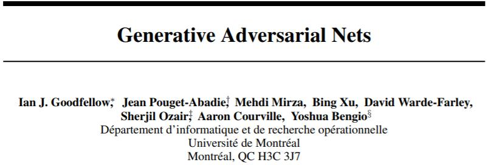

# GAN生成对抗网络

* [返回上层目录](../deep-generative-models.md)

paper: [*Generative Adversarial Nets*](https://papers.nips.cc/paper/2014/file/5ca3e9b122f61f8f06494c97b1afccf3-Paper.pdf)

感觉就是把多智能体协调控制的博弈思想，用到了机器学习里边，生成器和判别器就相当于两个智能体，然后通过一定的规则博弈，决策

我只能说强推李宏毅老师的视频，b站搜“(强推)李宏毅2021春机器学习课程”P40-P43都是讲GAN的，是网上讲GAN的最好中文入门教程，没有之一。不过，如果你对深度学习也没有任何基础的话，那就建议从P1开始看了。

[GAN论文阅读笔记1：从零推导GAN](https://zhuanlan.zhihu.com/p/56861824)

colab官方教程里有个写的非常详细的dcgan的demo，有详细的讲解还可以直接在线运行，对新手非常友好。我也是通过这个demo上手dcgan的。

https://colab.research.google.com/github/pytorch/tutorials/blob/gh-pages/_downloads/dcgan_faces_tutorial.ipynb

第一步——上手：我觉得最好还是先下一套代码，下一套数据，搭个环境，从一个具体的生成任务开始动手做比较容易，比如人脸生成、室内场景生成等，看看生成的效果，了解生成的目的和基本方法，这样可以先有个感性的认识。

第二步——理解原生GAN：如果你希望对GAN背后的原理做以理解（毕竟你毕业设计中多多少少得贴点公式，而且答辩时你还得回答老师的问题），恐怕得费点功夫。可以去Bilibili上看李宏毅老师的生成是对抗网络的课程，帮助你理解，李宏毅老师讲课是非常清晰且有趣的。然后在此基础上把Goodfellow的那篇论文从头到尾无死角的全部吃透了，这样你就在原理上对原生GAN算入门了。

第三步——了解各类GAN变种：如果希望更加深刻的理解GAN的原理，以及各类GAN或者生成模型的变种，这对你数学的基础提出了比较高的要求。推荐苏剑林的“科学空间”（百度搜索即可），里面有详细的数学推导。也可以看我写的专栏文章《从GAN到W-GAN的“硬核拆解”》系列。

https://www.zhihu.com/question/504711648/answer/2263079120

[【 李宏毅深度学习 】Introduction of Generative Adversarial Network (GAN)](https://www.bilibili.com/video/av17412504/)

[李宏毅GAN合集-Generative Adversarial Network (2017-2018)](https://www.bilibili.com/video/BV1NZ4y1A78D)

[【 李宏毅深度学习 】2018最新GAN课程 Generative Adversarial Network (GAN), 2](https://www.bilibili.com/video/BV17W411F7Fs)

https://www.zhihu.com/question/504711648/answer/2305496018

# 参考资料

- [到底什么是生成式对抗网络GAN？](https://zhuanlan.zhihu.com/p/26994666)

===

[A Beginner's Guide to Generative Adversarial Networks (GANs)](https://wiki.pathmind.com/generative-adversarial-network-gan)

[知乎：生成对抗网络GAN和强化学习RL有什么紧密联系？](https://www.zhihu.com/question/304751079/answer/546364527)

[通俗理解生成对抗网络GAN](https://zhuanlan.zhihu.com/p/33752313)

[深度学习最强资源推荐：一文看尽 GAN 的前世今生](https://mp.weixin.qq.com/s/_nqL1REIKwPB6yHm7XCpjQ)

[通俗理解生成对抗网络GAN](https://zhuanlan.zhihu.com/p/33752313)

[机器学习：残差学习、RNN、GAN、迁移学习、知识蒸馏](https://blog.csdn.net/holly_Z_P_F/article/details/122337962)

GAN(生成式对抗网络，Generative adversarial network)。GAN可以生成不存在于真实世界的数据，用于图像生成和数据增强。模型通过框架中两个模块：生成模型（Generative Model）和判别模型（Discriminative Model）的互相博弈学习产生相当好的输出。
以图像为例子，假设我们有两个网络，G（Generator）和D（Discriminator）。

G是一个生成图片的网络，它接收一个随机的噪声z，通过这个噪声生成图片，记做G(z)。
D是一个判别网络，判别一张图片是不是“真实的”。输出1为真，反之为0.
在训练过程中，生成网络G的目标就是尽量生成真实的图片去欺骗判别网络D。而D的目标就是尽量把G生成的图片和真实的图片分别开来。这样，G和D构成了一个动态的“博弈过程”。
最后博弈的结果是什么？在最理想的状态下，G可以生成足以“以假乱真”的图片G(z)。对于D来说，它难以判定G生成的图片究竟是不是真实的，因此D(G(z)) = 1。这样我们的目的就达成了：我们得到了一个生成式的模型G，它可以用来生成图片。

[通俗理解GAN（一）：把GAN给你讲得明明白白](https://zhuanlan.zhihu.com/p/266677860)

