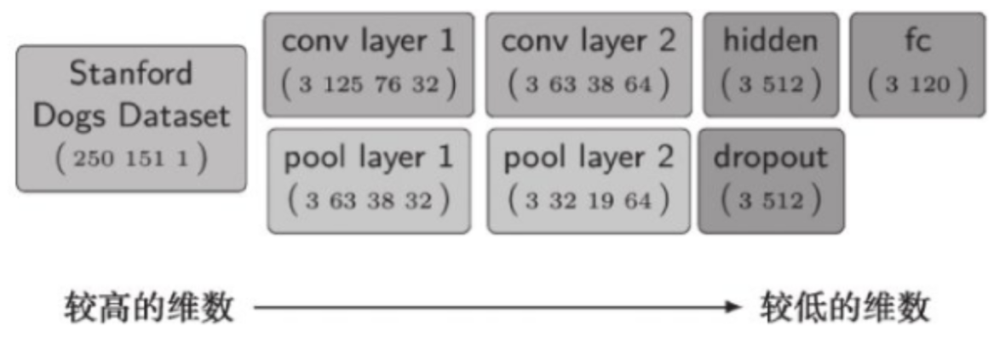
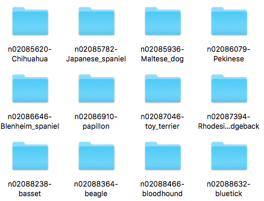
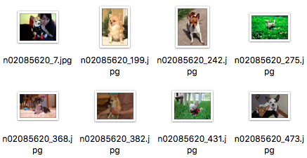

# 基于TenserFlow的目标识别与分类

* [返回上层目录](../tensorflow1.0.md)


# 简化版AlexNet的实现

我们的网络架构采取了AlexNet的简化版本，但并未使用AlexNet的所有层，也和TensorFlow提供的CNN入门教程非常类似。

## 网络的架构



## Stanford Dogs数据集

[Stanford Dogs Dataset](http://vision.stanford.edu/aditya86/ImageNetDogs/)，[ReadMe](http://vision.stanford.edu/aditya86/ImageNetDogs/README.txt)

该数据集的总大小大约800M，需要将下载的压缩文件解压至和程序文件同目录下的一个新的名为`imagenet-dogs`的目录下。

该数据集包含120个不同品种的狗的图像，其中80%的图像用于训练，而其余20%的图像用于测试。



每个狗品种都对应一个类似于`n02085620-Chihuahua`的文件夹，其中目录名称的后一半对应于狗品种的英语表达。在每个目录中，都有大量属于该品种的狗的图像，每幅图都是JPEG格式且尺寸各异。



## 一步步写代码

### 将图像转为TFRecord文件

（1）引入tf包

```python
import tensorflow as tf
import os

sess = tf.InteractiveSession()
```

（2）读取目录下的每一个图片的路径和名称：

```python
import glob

image_filenames = glob.glob("./imagenet-dogs/n02*/*.jpg")
image_filenames[0:2]
```

输出：

```js
['./imagenet-dogs/n02097658-silky_terrier/n02097658_26.jpg',
 './imagenet-dogs/n02097658-silky_terrier/n02097658_4869.jpg']
```

（3）将品种和各自品种的图像名称放到train和test字典中。

```python
from itertools import groupby
from collections import defaultdict

training_dataset = defaultdict(list)
testing_dataset = defaultdict(list)

# 将文件名分解为品种和对应的文件名，品种对应于文件夹名称
image_filename_with_breed = map(lambda  filename: (filename.split("/")[2], filename), image_filenames)
# ('n02097658-silky_terrier', './imagenet-dogs/n02097658-silky_terrier/n02097658_26.jpg')

# 依据品种对（上述返回的元组的第0个分量）对图像分组
for dog_breed, breed_images in groupby(image_filename_with_breed, lambda x: x[0]):
    # 枚举每个品种的图像，并将大约20%的图像划入测试集
    for i, breed_image in enumerate(breed_images):
        if i % 5 == 0:
            testing_dataset[dog_breed].append(breed_image[1])
        else:
            training_dataset[dog_breed].append(breed_image[1])
            
    # 检查每个瓶中的测试图像是否至少有全部图像的18%
    breed_training_count = len(training_dataset[dog_breed])
    breed_testing_count = len(testing_dataset[dog_breed])
    
    assert round(breed_testing_count / (breed_training_count + breed_testing_count), 2) > 0.18, "Not enough testing images."
```

（4）打开每幅图像，将其专为灰度图，调整尺寸，然后添加到TFRecord文件中。

```python
def write_records_file(dataset, record_location):

    if not os.path.exists(record_location):
        print("目录 %s 不存在，自动创建中..." % (record_location))
        os.makedirs(record_location)
    
    writer = None
    current_index = 0
    
    for breed, images_filenames in dataset.items():
        for image_filename in image_filenames:
            if current_index % 100 == 0:
                if writer:
                    writer.close()
                record_filename = "{record_location}-{current_index}.tfrecords".format(
                    record_location=record_location, current_index=current_index)
                writer = tf.python_io.TFRecordWriter(record_filename)
            current_index += 1
            image_file = tf.read_file(image_filename)
            # 在ImageNet的图像中，有少量无法被TensorFlow识别为JPEG的图像，利用try/catch可将这些图像忽略
            try:
                image = tf.image.decode_jpeg(image_file)
            except:
                print(image_filename)
                continue
            # 抓换为灰度图可以减少处理的计算量和内存占用，但这不是必须的
            grayscale_image=tf.image.rgb_to_grayscale(image)
            resized_image=tf.image.resize_images(grayscale_image, [250, 151])
            # 这里之所以用td.cast，是因为虽然尺寸更改后的图像的数据类型是浮点型，但是rgb值尚未处理转换到[0,1)区间内
            # tobytes是将图片转成二进制
            image_bytes = sess.run(tf.cast(resized_image, tf.uint8)).tobytes()
            #将表示种类的字符串转换为python默认的utf-8格式，防止有问题
            image_label = breed.encode("utf-8")

            example = tf.train.Example(features=tf.train.Features(feature={
                'label': tf.train.Feature(bytes_list=tf.train.BytesList(value=[image_label])),
                'image': tf.train.Feature(bytes_list=tf.train.BytesList(value=[image_bytes]))
            }))
            # 将文件序列化为二进制字符串
            writer.write(example.SerializeToString())
        writer.close()

# 分别将测试数据和训练数据写入tensorflow record，
# 分别保存在文件夹./output/testing-images/和./output/training-images/下面。
write_records_file(testing_dataset, "./output/testing-images/testing-image")
write_records_file(training_dataset, "./output/training-images/training-image")
```

### 加载图像

一旦测试集和训练集被转换为TFRecord格式，便可以按照TFRecord文件而非JPEG文件进行读取。我们的目标是每次加载少量图像及相应的标签。

```python
# string_input_producer会产生一个文件名队列；match_filenames_once获取符合正则表达式的文件列表
filename_queue = tf.train.string_input_producer(tf.train.match_filenames_once("./output/training-images/*.tfrecords"))
# reader从文件名队列中读数据。对应的方法是reader.read
reader = tf.TFRecordReader()
_, serialized = reader.read(filename_queue)

# parse_single_example将Example协议内存块(protocol buffer)解析为张量
features = tf.parse_single_example(
    serialized,
    features={
        'label': tf.FixedLenFeature([], tf.string),
        'image': tf.FixedLenFeature([], tf.string),
    })

# 获取图像
record_image = tf.decode_raw(features['image'], tf.uint8)
# 修改图像的形状有助于训练和输出的可视化
image = tf.reshape(record_image, [250, 151, 1])
# 获取标签
label = tf.cast(features['label'], tf.string)

min_after_dequeue = 10
batch_size = 3
capacity = min_after_dequeue + 3 * batch_size
image_batch, label_batch = tf.train.shuffle_batch(
    [image, label], batch_size=batch_size, capacity=capacity, min_after_dequeue=min_after_dequeue)

```

### 模型

（1）第一个卷积层

```python
# 将图像转换为灰度值位于[0,1]的浮点类型，以与convolution2d期望的输入匹配
float_image_batch = tf.image.convert_image_dtype(image_batch, tf.float32)

conv2d_layer_one = tf.contrib.layers.convolution2d(
    float_image_batch,
    num_output_channels=32,     # The number of filters to generate
    kernel_size=(5,5),          # It's only the filter height and width.
    activation_fn=tf.nn.relu,
    weight_init=tf.random_normal,
    stride=(2, 2),
    trainable=True)

pool_layer_one = tf.nn.max_pool(conv2d_layer_one,
    ksize=[1, 2, 2, 1],
    strides=[1, 2, 2, 1],
    padding='SAME')

# 注意，卷积输出的第1维和最后一维未发生改变，但中间的两维发生了变化
conv2d_layer_one.get_shape(), pool_layer_one.get_shape()
```

（2）第二个卷积层

```python
conv2d_layer_two = tf.contrib.layers.convolution2d(
    pool_layer_one,
    num_output_channels=64,        # More output channels means an increase in the number of filters
    kernel_size=(5,5),
    activation_fn=tf.nn.relu,
    weight_init=tf.random_normal,
    stride=(1, 1),
    trainable=True)

pool_layer_two = tf.nn.max_pool(conv2d_layer_two,
    ksize=[1, 2, 2, 1],
    strides=[1, 2, 2, 1],
    padding='SAME')

conv2d_layer_two.get_shape(), pool_layer_two.get_shape()
```

（3）展开最后一个池化层

```python
flattened_layer_two = tf.reshape(
    pool_layer_two,
    [
        batch_size,  # Each image in the image_batch
        -1           # Every other dimension of the input
    ])

flattened_layer_two.get_shape()
```

（4）两个全连接层

```python
# weight_init参数也可接收一个可用参数，这里使用一个lambda表达式返回了一个截断的正态分布
# 并指定了该分布的标准差
hidden_layer_three = tf.contrib.layers.fully_connected(
    flattened_layer_two,
    512,
    weight_init=lambda i, dtype: tf.truncated_normal([38912, 512], stddev=0.1),
    activation_fn=tf.nn.relu
)

# 对一些神经元进行dropout处理，消减它们在模型中的重要性
hidden_layer_three = tf.nn.dropout(hidden_layer_three, 0.1)

# 输出是前面的层与训练中可用的120个不同的狗的品种的全连接
final_fully_connected = tf.contrib.layers.fully_connected(
    hidden_layer_three,
    120,  # Number of dog breeds in the ImageNet Dogs dataset
    weight_init=lambda i, dtype: tf.truncated_normal([512, 120], stddev=0.1)
)
```

### 训练

```python
import glob

# 找到位于image-dog路径下的所有目录名(n02085620-Chihuahua,...)
labels = list(map(lambda c: c.split("/")[-1], glob.glob("./imagenet-dogs/*")))

# 匹配每个来自label_batch的标签并返回它们在类别列表中的索引。
train_labels = tf.map_fn(lambda l: tf.where(tf.equal(labels, l))[0,0:1][0], label_batch, dtype=tf.int64)
```

损失、优化器、学习率

```python
loss = tf.reduce_mean(
    tf.nn.sparse_softmax_cross_entropy_with_logits(
        final_fully_connected, train_labels))

batch = tf.Variable(0)
learning_rate = tf.train.exponential_decay(
    0.01,
    batch * 3,
    120,
    0.95,
    staircase=True)

optimizer = tf.train.AdamOptimizer(
    learning_rate, 0.9).minimize(
    loss, global_step=batch)

train_prediction = tf.nn.softmax(final_fully_connected)
```

后续步骤

```python
# setup-only-ignore
filename_queue.close(cancel_pending_enqueues=True)
coord.request_stop()
coord.join(threads)
```

## 最终的代码


# 参考资料

* [backstopmedia/tensorflowbook](https://github.com/backstopmedia/tensorflowbook/blob/master/chapters/05_object_recognition_and_classification/Chapter%205%20-%2005%20CNN%20Implementation.ipynb)
* [《面向机器智能的tensorflow实践》第5.5节Stanford Dogs例程实现](https://blog.csdn.net/hnxyxiaomeng/article/details/78517350)
* [Alex-AI-Du/Tensorflow-Tutorial](https://github.com/Alex-AI-Du/Tensorflow-Tutorial/blob/master/standford_dog/ST_run.py)

本文参考了这几篇资料。


