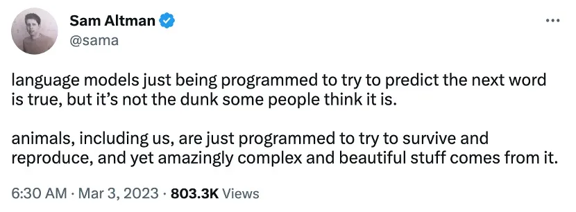

# Unsupervised Sentiment Neuron

* [返回上层目录](../unsupervised-sentiment-neuron.md)

OpenAI blog: [openai research: unsupervised-sentiment-neuron](https://openai.com/research/unsupervised-sentiment-neuron)

# 为什么OpenAI坚信大型语言模型能够实现AGI

当ChatGPT刚问世时，我也对大型语言模型是否能实现通用人工智能抱有疑虑。然而，在观看了OpenAI联合创始人兼首席科学家Ilya的两次访谈之后，我开始倾向于认为大型语言模型或许有可能实现通用人工智能（2023年有望成为AGI元年），尽管仍面临许多挑战。

- [Ilya Sutskever: Deep Learning | Lex Fridman Podcast #94](https://www.youtube.com/watch%3Fv%3D13CZPWmke6A)
- [AI Opener: OpenAI’s Sutskever in Conversation With Jensen Huang](https://www.youtube.com/watch%3Fv%3DZZ0atq2yYJw)

 第一个访谈发生在2020年5月，当时还在讨论GPT-2，但GPT-3的训练应该也已经接近尾声。第二个访谈是在刚刚过去的GTC会议上，英伟达CEO黄仁勋与Ilya进行了对话。

两次访谈中，Ilya都提到了他们2017年的工作[Unsupervised Sentiment Neuron](https://openai.com/research/unsupervised-sentiment-neuron)，论文题目是[Learning to Generate Reviews and Discovering Sentiment](https://arxiv.org/pdf/1704.01444.pdf)，尽管这篇文章并没有受到太多关注（甚至被ICLR 2018拒稿），但其中的发现：“在仅仅被训练用于预测下一个字符之后，神经网络自动学会了分析情感”，对OpenAI后续的研究产生了深远的影响。Ilya将Sentiment Neuron称为GPT的前身。

Ilya在进行AlexNet研究时甚至更早之前，就深信只要神经网络足够大且足够深，并配备充足的数据和计算资源（GPU并行编程的出现让这成为可能），就能解决复杂任务。然而，许多人并未意识到这一点的重要性。在Sentiment Neuron的研究中，他们惊奇地发现，在将LSTM的单元大小从500增加到4000时，某个特定神经元能够高度预测整个评论的情感分类。换句话说，通过仅仅预测下一个字符（UTF-8编码的字节），模型自动地产生了高级的语义信息。

然而，他们发现他们的方法在处理较长文档时表现不佳（由于LSTM无法有效处理长距离依赖问题），另外，他们的研究表明，训练一个更大的模型能够学习到更好的特征。因此，当Transformer出现时，他们立刻意识到这正是他们所寻找的方法。至始至终，他们关注的是如何在更大且更多样化的数据（世界知识）上，增加模型的大小（能力），并有效地训练（利用更多计算资源）。随后，他们专门研究了大模型的scaling law，以更好地预测模型性能（准确预测下一个token的能力）与模型大小、数据集大小以及计算量之间的关系。

为何仅通过预测下一个词，大型语言模型就能展现出如此强大的能力呢？我们来看一下OpenAI的CEO Sam Altman是如何解释这个问题的：

当语言模型足够大（具有巨大的潜力）且使用大量数据进行训练时，这些数据（无论是文本数据还是多模态数据）都包含了真实世界的投射，涵盖了无数不同的任务。为了更好地预测下一个token，模型需要尽可能地理解这些任务。Ilya给出了一个例子：在一个拥有复杂情节和众多角色的侦探小说中，在故事结尾，预测下一个词【凶手是__】。这要求模型具备强大的理解和推理能力，以找到最可能的预测。随着预测的准确性不断提高，对文本的理解也越来越深刻。

那么，这种能力是如何实现的呢？可以类比为人类的进化过程，一个庞大的语言模型为了实现其目标（更准确地预测下一个token），不断地进化：通过简单的梯度下降，不合适的参数被淘汰，新的更适合的参数逐渐浮现。只要模型足够大，数据足够多，训练时间足够长，理论上，语言模型可以进化出各种能力（包括我们能想到的和想不到的），而且，目前还没有看到明显的瓶颈。

当然，由于训练数据质量和潜在偏差的原因，大型语言模型的能力可能参差不齐，甚至产生有害的内容。比如说，模型产生的幻觉（Hallucinations），即胡说八道，是大型模型最常被诟病的地方。然而，换个角度看，或许这种能力对于大型模型来说是中性的，只是对于人类来说可能有害。因此，如何将大型模型的能力与人类的偏好和价值观对齐（align），成为了一个非常热门的研究方向。目前最常用的方法就是基于人类反馈的强化学习（RLHF）。RLHF是OpenAI和谷歌DeepMind团队于2017年共同开发的一种方法，旨在在不依赖明确奖励函数的情况下解决复杂的强化学习任务（避免人们为复杂目标编写目标函数，从而导致不受欢迎甚至危险的行为）。人们对模型的多个输出进行排序，然后利用RLHF来改进模型的行为。通过这种方式，模型能够根据人类的评价和偏好来调整自己的表现，从而更好地满足用户的需求。 

是否可以通过RLHF完全消除大型模型的幻觉现象仍然存在争议。在通往AGI的道路上，我们仍面临许多的挑战。然而，大型语言模型的出现和持续发展让我们看到了AGI的曙光。

# 参考资料

* [通用人工智能是否能实现？如何实现？](https://www.zhihu.com/question/298805901/answer/2957903772)